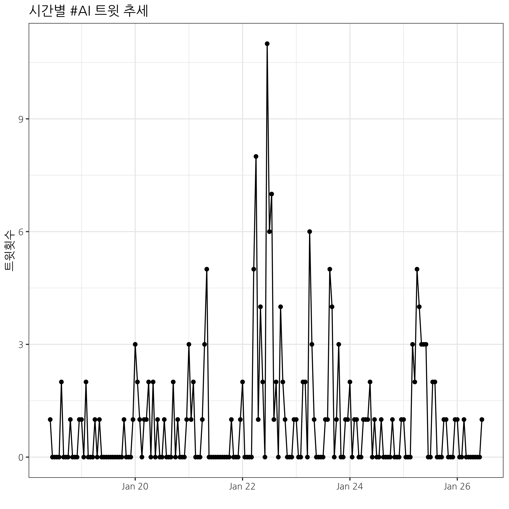

```{r setup2, include=FALSE}
knitr::opts_chunk$set(echo = TRUE, message=FALSE, warning=FALSE,
                      comment="", digits = 3, tidy = FALSE, prompt = FALSE, fig.align = 'center')

library(reticulate)
use_condaenv("anaconda3")
# reticulate::repl_python()
```

# 사전 준비 {#prerequisite-compendium}

[트위터 데이터 분석 보고서](https://statkclee.github.io/ingest-data/ingest-twitter-data-science.html)에 나와 있는 다양한 기능을 자동화하기 위해서는 몇가지 사전 준비 작업이 필요하다.

- `Makefile` 작성
- `Rscript` 쉘 스크립트 작성 (파라미터 전달 포함)
- 파라미터 `Makefile` 작성: 해쉬태그를 파라미터로 전달

## `Rscript` 쉘 스크립트 작성 {#shell-script-run}

`get_data()` 함수에 `search_tweets()` 함수를 자유로이 다루려면 파라미터를 넣어 다양한 해쉬태그를 트윗 갯수와 함께 가져오는 것이 필요하다. 이를 위해서 앞서 [`compendium_301`](https://github.com/statkclee/compendium_301)에서 작성한 스크립트를 일부 수정해야 한다.

`R/` 디렉토리 `get_data.R` 스크립트에서 인자를 받을 수 있도록 변화를 주고 자료형도 맞춰준다.

```{r run-twitter-function, eval=FALSE}
## R/ 디렉토리 get_data.R 스크립트
# 0. 환경설정 -----
library(rtweet)  # install.packages("rtweet")
library(tidyverse)

args <- commandArgs(trailing=TRUE)

topic <- args[1]
num_twits <- args[2]

get_data <- function(topic, num_twits) {
  
  tw_dat <- search_tweets(topic, n = num_twits, include_rts = TRUE, lang = "ko")

  tw_dat %>% 
    write_rds("data/tw_dat.rds")
}

get_data(topic, as.integer(num_twits))
```

`rscript` 명령어를 `R/get_data.R` R 스크립트를 실행시키는데 인자를 두개 해쉬태그와 트윗갯수를 함께 넣어 실행시킨다.

```{bash run-script-get-data}
rscript R/get_data.R '#불평등' 100
```

```{bash check-bash-run}
ls -al data/
```

## 그래프 생성 {#shell-create-graph}

앞서 해쉬태그 연관 트윗 데이터를 가져와서 로컬 파일로 저장시키는 것과 동일하게 트윗 추세를 시각화하는 그래프를 생성하여 로컬 파일로 `.png` 저장을 시킨다. 이를 위해서 마찬가지로 `rsctipt`에 인자를 넘기는 방식으로 R 스크립트를 일부 변형시킨다.

```{r run-create-graph-script, eval=FALSE}
# 0. 환경설정 -----
library(rtweet)  # install.packages("rtweet")
library(tidyverse)
library(extrafont)
loadfonts()

# dir.create("processed")

args <- commandArgs(trailing=TRUE)
topic <- args[1]

graph_trend <- function(topic) {
  
  tw_dat <- read_rds("data/tw_dat.rds")
  
  ts_data(tw_dat, by="hours") %>% 
    ggplot(aes(x=time, y=n)) +
    geom_line() +
    geom_point() +
    labs(x="", y="트윗횟수", title=paste0("시간별 ", topic, " 트윗 추세")) +
    theme_bw(base_family = "NanumGothic") +
    theme(legend.position = "top")
  
  ggsave("processed/twit_trend.png")
}

graph_trend(topic)
```

이제 스크립트를 생성시키게 되면 로컬 파일로 `processed/twit_trend.png` 그래프 파일을 생성시킬 수 있게 된다.

```{bash run-script-create-graph}
rscript R/graph_trend.R '#불평등'
```

이제 로컬 파일에 저장된 그래프 파일을 가져온다.

{#id .class width="77%"}

# `Makefile` 제작  [^korean-latex] {#Makefile}

[^korean-latex]: ["한글을 포함한 R Markdown 컴파일"](https://github.com/jaimyoung/data-science-in-korean/blob/master/r-markdown-korean.md)

권재명 박사님의 안내에 따라 <http://wiki.ktug.org/wiki/wiki.php/설치하기MacOSX/MacTeX>을 참조하여 
일단 $\LaTex$ / $\xeLaTex$를 설치하고, 특히 나눔폰트(Nanum*)를 다운받아 설치한다. 
시간이 약 2시간 정도 소요되니 미리 충분히 준비를 한다.

```{bash install-Korean-LaTex, eval = FALSE}
sudo tlmgr repository add http://ftp.ktug.org/KTUG/texlive/tlnet ktug
sudo tlmgr pinning add ktug "*"
sudo tlmgr install nanumttf hcr-lvt
sudo tlmgr update --all --self
```


본격적으로 `Makefile`을 제작하여 본다. `make clean`과 `make all`을 만들어 코드를 깔끔하게 정리한다.

```{r Makefile, eval=FALSE}
# Makefile
DATA = data
REPORT = report
TEMP = processed

all: report/make_report.html

$(DATA)/tw_dat.rds:
	Rscript R/get_data.R "#불평등" 100

$(TEMP)/twit_trend.png: $(DATA)/tw_dat.rds
	Rscript R/graph_trend.R "#불평등"

$(REPORT)/make_report.html: $(DATA)/tw_dat.rds $(TEMP)/twit_trend.png
	Rscript R/make_report.R

clean:
	rm -rf $(DATA)/tw_dat.rds 
	rm -rf $(TEMP)/twit_trend.png 
	rm -rf $(REPORT)/make_report.html $(REPORT)/make_report.pdf $(REPORT)/make_report.docx
	rm -rf $(REPORT)/*.tex $(REPORT)/*.log 
```

`report.R` 파일에는 한글을 처리하기 위해서 한글 폰트와 더불어 `latex_engine`을 `xelatex`로 지정한다.

PDF 보고서 파일 생성을 위해서 `pdf_document()` 함수에 `latex_engine`과 더불어 `mainfont='NanumGothic'`를 지정한다. 특히, $\LaTeX$에서 나눔폰트를 사전에 설치하여 PDF 파일이 깨지는 일을 미연에 방지한다.

```{r make-report, eval = FALSE}
## make_report.R 파일
library(tidyverse)
library(rmarkdown)

rmarkdown::render("report/make_report.Rmd",
                  output_format="html_document",
                  output_file = "make_report.html",
                  clean = TRUE,
                  encoding = 'UTF-8',
                  output_dir = "report")

rmarkdown::render("report/make_report.Rmd",
                  output_format = pdf_document(toc=TRUE, latex_engine = 'xelatex',
                                 pandoc_args = c("--variable", "mainfont=NanumGothic")),
                  clean = TRUE,
                  output_file = "make_report.pdf",
                  encoding = 'UTF-8',
                  output_dir = "report")

rmarkdown::render("report/make_report.Rmd",
                  output_format = word_document(reference_docx = "../assets/word_template.docx"),
                  clean = TRUE,
                  output_file = "make_report.docx",
                  encoding = 'UTF-8',
                  output_dir = "report")
```

상기 파일을 `make all` 명령어로 실행시키게 될 경우 자동으로 `report\` 디렉토리에 `make_report.pdf`, `make_report.docx`, `make_report.html` 파일이 생성되게 된다.

```{bash Makefile-run}
make all
```

작업 결과를 다음 `ls` 명령어로 실행할 수 있다.

```{bash Makefile-run-check}
ls -al report/
```


# 파라미터화된 `Makefile` 제작 [^make-paramterized]  {#parametrized-Makefile}

[^make-paramterized]: [stackoverflow, "Passing additional variables from command line to make"](https://stackoverflow.com/questions/2826029/passing-additional-variables-from-command-line-to-make)

파라미터화된 `Makefile` 제작이 필요한데 이유는 해쉬태그(hashtag, #)를 매번 타이핑하는 것이 중복되는 면이 있어 이를 방지하고자 `make all` 명령어로 해쉬태그를 파라미터로 넘겨 이를 처리한다. 

먼저 `Makefile`에 변수를 사용해서 넘길 파라미터를 미리 정의한다. 

- `$(TOPIC)`: 해쉬태그
- `$(NUM_TWIT)`: 트윗 갯수

```{r parameterized-Makefile, eval=FALSE}
# parameterized Makefile
DATA = data
REPORT = report
TEMP = processed

all: report/make_report.html

## Get Twitter Data
$(DATA)/tw_dat.rds:
	Rscript R/get_data.R $(TOPIC) $(NUM_TWIT)

## Visualize Twitter Data
$(TEMP)/twit_trend.png: $(DATA)/tw_dat.rds
	Rscript R/graph_trend.R $(TOPIC)

$(TEMP)/user_activity.png: $(DATA)/tw_dat.rds
	Rscript R/analyze_activity.R

$(TEMP)/retweet_network.png: $(DATA)/tw_dat.rds
	Rscript R/visualize_retweets.R

$(TEMP)/bow_nlp.png: $(DATA)/tw_dat.rds
	Rscript R/visualize_nlp.R

## Make Reports	
$(REPORT)/make_report.html: $(DATA)/tw_dat.rds $(TEMP)/twit_trend.png $(TEMP)/user_activity.png $(TEMP)/retweet_network.png $(TEMP)/bow_nlp.png
	Rscript R/make_report.R

clean:
	rm -rf $(DATA)/tw_dat.rds 
	rm -rf $(TEMP)/twit_trend.png $(TEMP)/user_activity.png $(TEMP)/retweet_network.png $(TEMP)/bow_nlp.png
	rm -rf $(REPORT)/make_report.html $(REPORT)/make_report.pdf $(REPORT)/make_report.docx
	rm -rf $(REPORT)/*.tex $(REPORT)/*.log 
```

상기와 같이 파라미터 `Makefile`을 정의한 후 `make` 명령어에 `변수=해쉬태그` 형태로 넘긴다. 단, `#`을 Esccape 해야 되서 앞에 역슬래쉬와 '\#AI'와 같은 형태로 변수값을 조정한다.

```{bash run-hashtag-Makefile}
make clean
make all TOPIC='\#AI'  NUM_TWIT=1000
```


# 트위터 분석 추가  {#parametrized-Makefile-twitter}

트위터 데이터를 가져와서 다양한 함수를 추가함으로써 텍스트, 네트워크, 시각화, 공간통계 등 분석을 추가할 수 있다. 분석된 스크립트는 `R/` 디렉토리에 넣고, 함수 실행결과는 `processed/` 디렉토리 내부에 그래프 이미지를 비롯한 각종 모형, 중간 데이터 파일 등을 저장시켜 둔다. 향후 추가 분석이 이뤄지는 경우 동일한 방식으로 `R/` 디렉토리에 함수를 추가시키고 `processed/` 디렉토리에 중간 산출물을 저장시킨다. 마지막으로  `.Rmd` 보고서 Literate Programming을 완성시킨다. 데이터 분석 결과물을 체계적으로 정리하고 나서 의사결정 및 데이터 분석을 통한 근거 내용을 차분하게 정리한다.

```{bash compendium-tree}
tree
```

