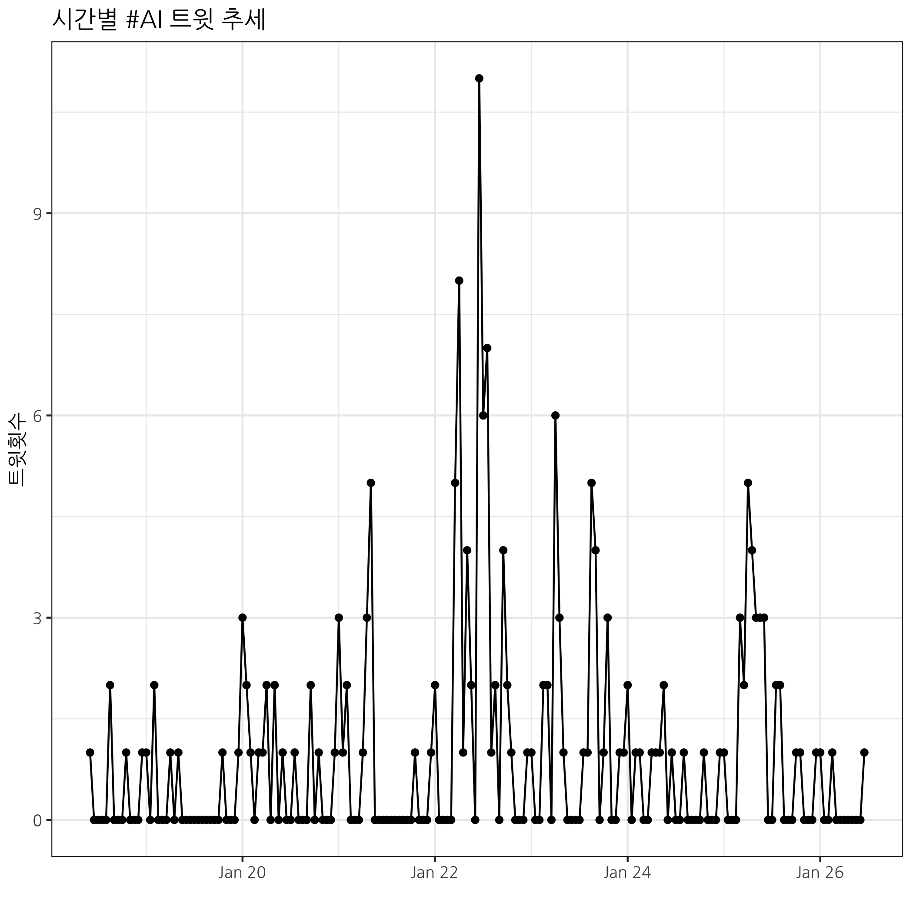

```{r setup, include=FALSE}
knitr::opts_chunk$set(echo = TRUE, message=FALSE, warning=FALSE,
                      comment="", digits = 3, tidy = FALSE, prompt = FALSE, fig.align = 'center')

knitr::opts_knit$set(root.dir = "..")
```

# 트위터 데이터 {#twitter-data}

```{r about-data}
twit_df <- read_rds("data/tw_dat.rds")

twit_df %>% 
  sample_n(10) %>% 
  select(screen_name, created_at, text) %>% 
  DT::datatable()
```


# 트위터 추세 {#twitter-trends}




