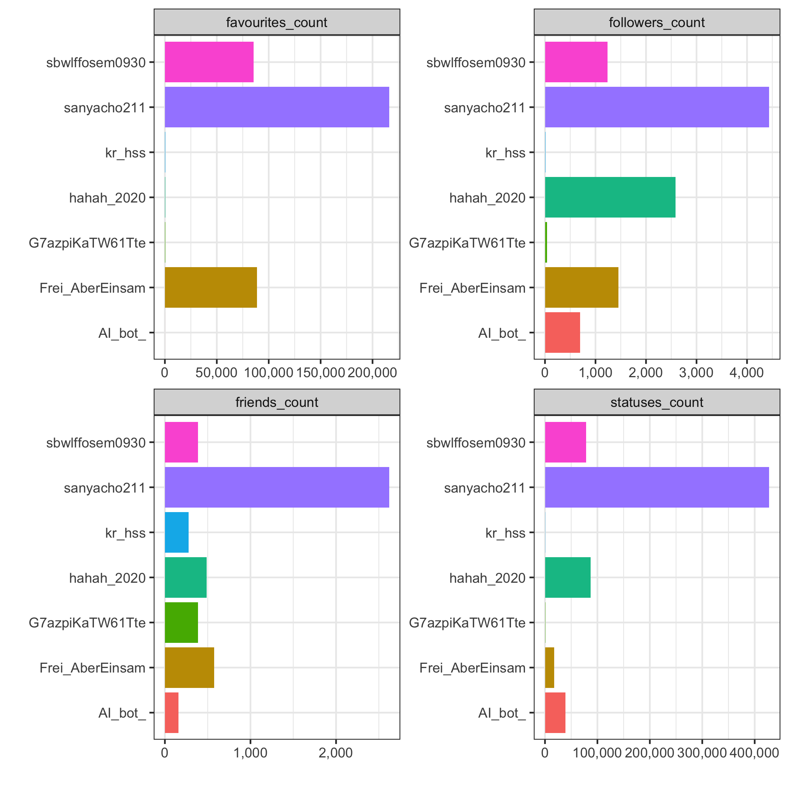
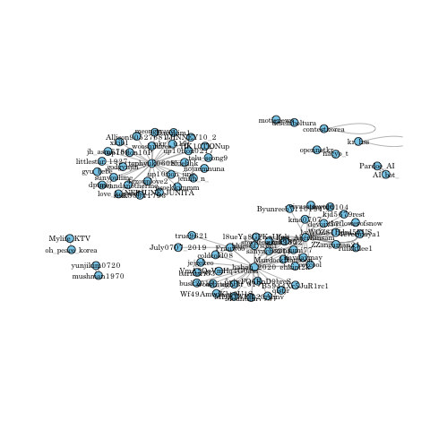

```{r setup, include=FALSE}
knitr::opts_chunk$set(echo = TRUE, message=FALSE, warning=FALSE,
                      comment="", digits = 3, tidy = FALSE, prompt = FALSE, fig.align = 'center')

knitr::opts_knit$set(root.dir = "..")
```

본 보고서는 [다양한 데이터 가져오기 - "트위터 데이터 과학"](https://statkclee.github.io/ingest-data/ingest-twitter-data-science.html) 웹문서를 `Makefile`을 작성하여 자동화하는 것을 재현하는 과정을 담고 있다.

# 트위터 데이터 {#twitter-data}

가장 먼저 트위터 데이터를 가져와야 한다. 이를 위해서 `get_data.R` 스크립트에 내장된 `get_data()` 함수를 사용해서 트위터에서 데이터를 가져와서 이를 내부적으로 저장시킨다. 원래 `DT` 팩키지를 사용해서 인터랙티브하게 분석 보고서를 작성하는 것이 좋으나, `.pdf`, `.docx` 파일 출력결과를 생각해서 `kable()` 함수를 사용해서 이를 정적 문서에서도 가시성이 좋도록 표를 작업한다. `kable()` 함수가 PDF, Word 파일 생성시 표를 제대로 만들어 내지 않는 경우 `pander()`로 대신한다.

```{r about-data}
library(tidyverse)
library(pander)

panderOptions('table.alignment.default', function(df)
    ifelse(sapply(df, is.numeric), 'right', 'left'))
panderOptions('table.split.table', Inf)
panderOptions('big.mark', ",")
panderOptions('keep.trailing.zeros', TRUE)

twit_df <- read_rds("data/tw_dat.rds")

twit_df %>% 
  sample_n(10) %>% 
  select(screen_name, created_at, text) %>% 
  pander()
```


# 트위터 추세 {#twitter-trends}

`graph_trend.R` 파일에 `graph_trend()` 함수를 사용해서 `twit_trend.png` 파일을 생성하여 특정 해쉬태그 트위터 데이터의 추세를 파악하고자 시각화하느 결과를 보여주는 것이 목적이다.


# 사용자 활동성 지표 {#twitter-activity}

특정 해쉬태그를 많이 언급한 사용자에 대한 기본 프로파일 정보를 `lookup_users()` 함수를 통해서 파악할 수 있고 이를 바탕으로 다음 사용자 프로파일 활동성 정보를 얻어올 수 있다.

- status
- followers
- friends
- favourites




# 리트윗 네트워크 분석 {#twitter-network}

특정 해쉬태그 관련 트윗 검색어를 넣어 `include_rts = TRUE` 리트윗을 추가하게 되면 리트윗(retweet) from, to 자료구조를 통해서 네트워크 분석을 통해서 트윗이 어떻게 전파되는지, 전파경로를 파악할 수 있다.



# 공간정보 {#twitter-geospatial}

특정 해쉬태그 관련 트윗 검색어를 넣어 어디에서 많이 하는지 공간정보가 포함되어 있는 경우 이를 반영시킨다.

```{r visualize-geospatial}
library(rtweet)
library(leaflet)

geo_twts_df <- lat_lng(twit_df) %>% 
  select(screen_name, text, lng, lat) %>% 
  filter(!is.na(lng))


geo_twts_df %>% 
  leaflet() %>% 
  addProviderTiles(providers$OpenStreetMap) %>% 
  addMarkers(lng=~lng, lat=~lat, clusterOptions = markerClusterOptions(),
             popup = ~ as.character(paste0("<strong>", paste0("유저명: ",`screen_name`), "</strong><br>",
                                           "-----------------------------------------------------------<br>",
                                           "&middot; 트윗: ", text))) 
```


# 트윗 텍스트 분석 {#twitter-nlp}

특정 해쉬태그관련 트윗 검색어를 텍스트 데이터로 놓고 이를 자연어처리 분석을 추진한다. 이를 위해서 `tidytext` 팩키지를 통해 단어 토큰을 만들이고 불용어 처리한 후에 단어 빈도수를 시각화해 보자.


